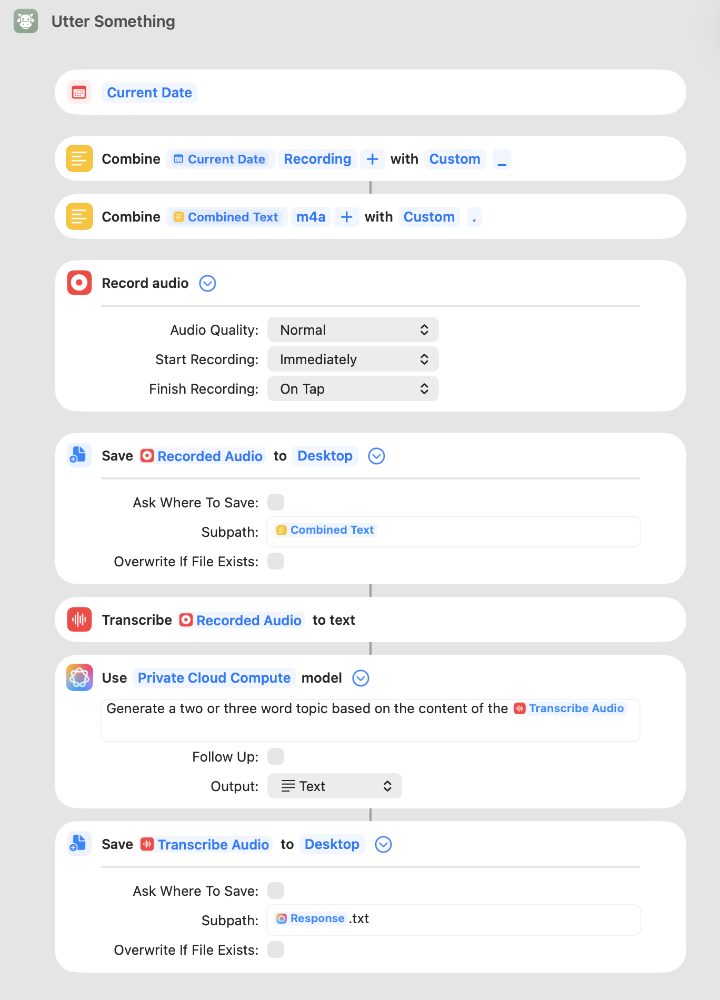

# Utter Something

A macOS/iOS Shortcut for capturing voice memos with automatic transcription and AI-generated filenames.

## Overview

Utter Something streamlines voice note capture by recording audio, transcribing it to text, and automatically naming the transcription file based on its content. This eliminates manual file naming and creates a self-organizing voice note archive.

## Requirements

- macOS Monterey (12.0) or later, or iOS 15 or later
- Microphone access permissions
- Apple Intelligence or Private Cloud Compute access (for topic generation)

## Installation

1. Download the `Utter Something.shortcut` file. [Utter Something](https://www.icloud.com/shortcuts/646e01c96ca7451d8a8796a4a33d551b)
2. Double-click the file to open it in the Shortcuts app.
3. Review the shortcut actions when prompted.
4. Click **Add Shortcut** to install.
5. Grant microphone permissions when first running the shortcut.

### Optional: Add to Menu Bar or Dock

- Open Shortcuts app
- Right-click on "Utter Something"
- Select **Add to Dock** or enable **Pin in Menu Bar** under Shortcut Details

## Usage

1. Run the shortcut via any of these methods:
   - Click the shortcut in the Shortcuts app
   - Use the menu bar icon (if pinned)
   - Invoke via Siri: "Run Utter Something"
   - Assign a keyboard shortcut in Shortcuts settings

2. Recording begins immediately upon launch.

3. Tap or click anywhere to stop recording.

4. The shortcut automatically:
   - Saves the audio file to Desktop
   - Transcribes the audio to text
   - Generates a 2-3 word topic from the transcription
   - Saves the transcription as a .txt file named with the generated topic

## Output Files

All files save to the Desktop with the following structure:
```
~/Desktop/
├── [YYYY-MM-DD]_Recording/
│   └── [date]_Recording.m4a    # Audio file
└── [AI-generated-topic].txt     # Transcription
```

### File Naming

- **Audio files**: Named with the current date plus "Recording" (e.g., `2026-02-01_Recording.m4a`)
- **Transcription files**: Named with an AI-generated 2-3 word topic based on content (e.g., `Project Update.txt`)

## Workflow Logic



## Configuration Options

The shortcut includes configurable parameters that can be modified by editing the shortcut in the Shortcuts app:

| Setting | Default | Options |
|---------|---------|---------|
| Audio Quality | Normal | Normal, Very High |
| Start Recording | Immediately | Immediately, On Tap |
| Finish Recording | On Tap | On Tap, After Time |
| Save Location | Desktop | Any folder |
| Overwrite Existing | No | Yes, No |

## Troubleshooting

### Microphone permission denied
- Open System Settings → Privacy & Security → Microphone
- Enable access for Shortcuts

### Transcription fails
- Verify the audio file was saved correctly
- Check that the recording contains audible speech
- Ensure sufficient disk space is available

### AI topic generation unavailable
- Requires Apple Intelligence or Private Cloud Compute
- Check System Settings → Apple Intelligence & Siri
- Feature availability varies by region and device

### Files not appearing on Desktop
- Check the Desktop folder directly in Finder
- Verify Desktop sync settings if using iCloud Desktop

## Limitations

- Transcription accuracy depends on audio clarity and speech recognition capabilities
- AI topic generation requires internet connectivity for Private Cloud Compute
- File naming conflicts may occur if the same topic is generated for multiple recordings (the shortcut does not overwrite by default)

## License

This shortcut is provided as-is for personal use.
